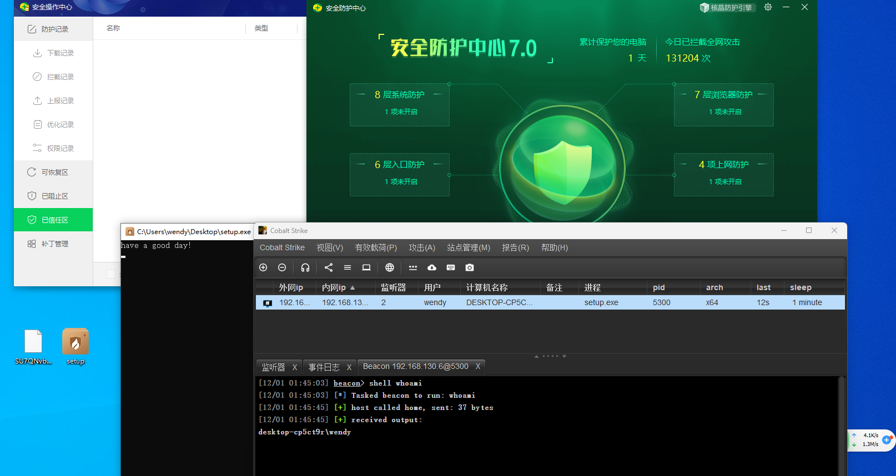
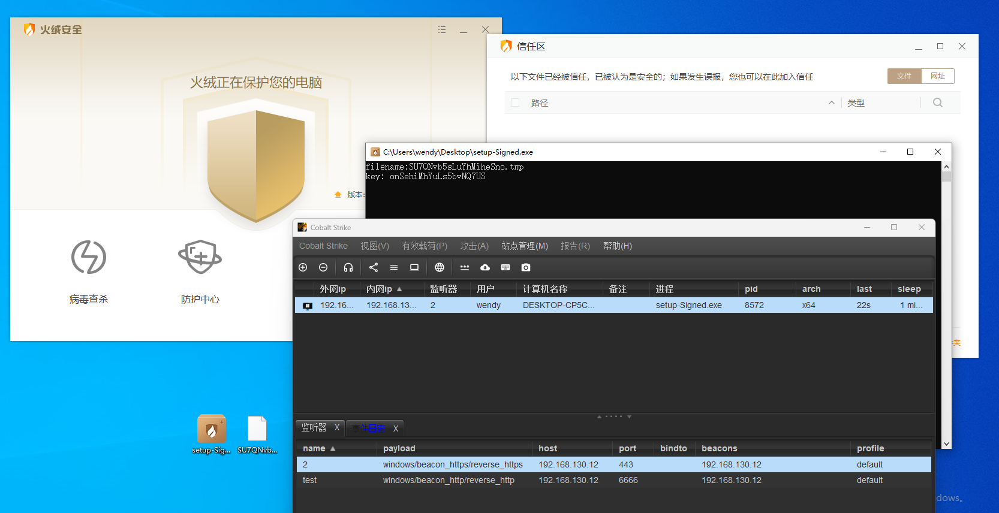
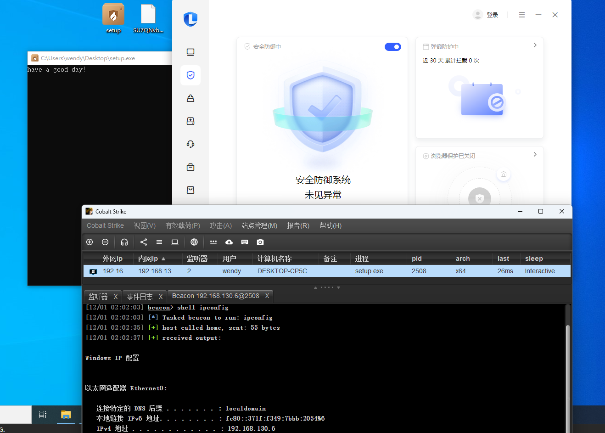
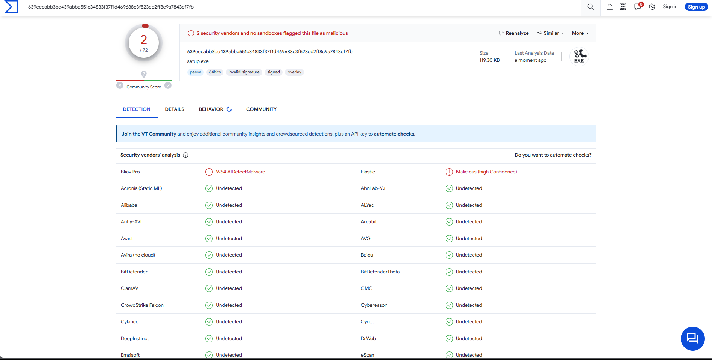
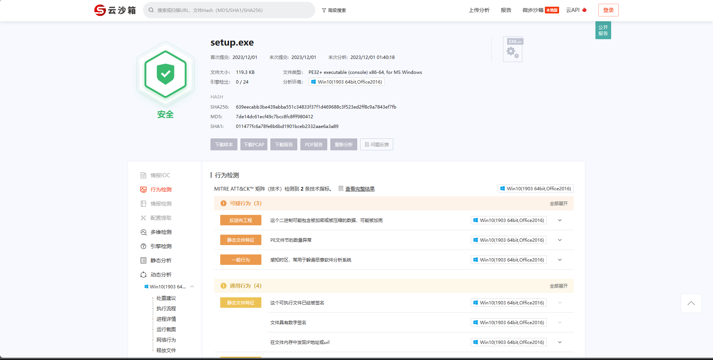

# C_Loader
cs loader，bypassav， 分离免杀某60，某绒等国内主流杀软

go run ./encoder.go生成临时文件，然后将编译main.c生成的loader与生成的临时文件放在同一目录下。
在没有其他文件干扰的情况（to fix）下可以正常上线。

配合这位师傅的工具搞签名和图标更佳：[传送门(记得给师傅一个star)](https://github.com/langsasec/Sign-Sacker)

查杀可以过国内主流的杀软：

vt和微步：

